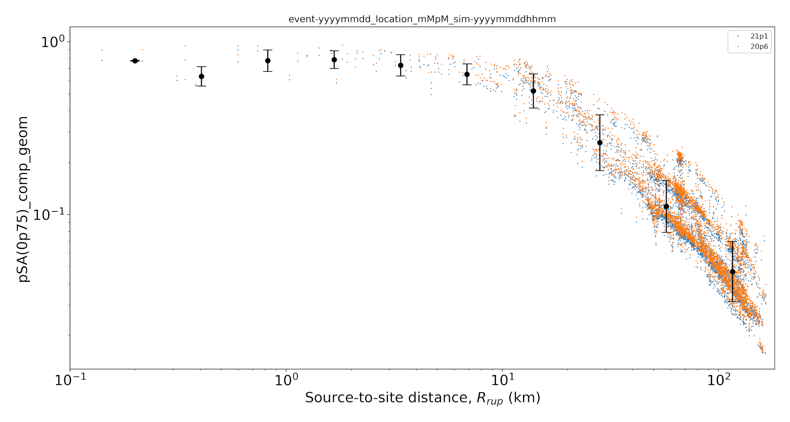
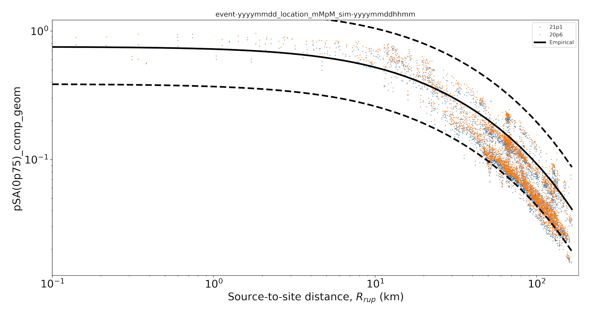
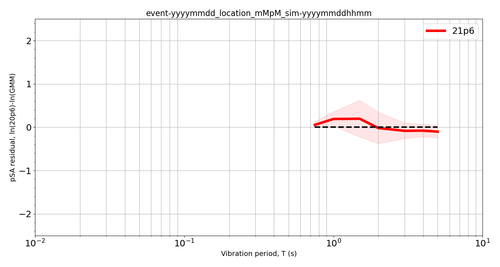
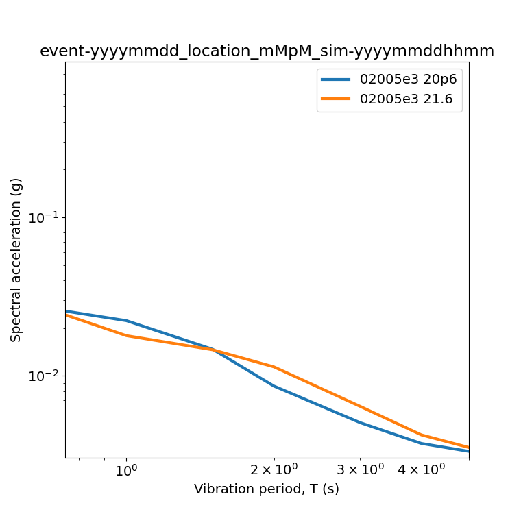
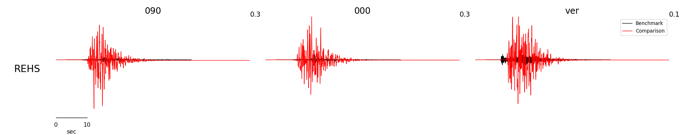

[](http://13.238.107.244:8080/job/visualization)[](https://opensource.org/licenses/MIT)

# Visualization

Visualization scripts, grouped into categories.

Install requires: [qcore](https://github.com/ucgmsim/qcore)\
Install command: ```pip install --user .```\
One time requirement: ```export PATH=$PATH:$HOME/.local/bin```


## /animation
Scripts with video / animated outputs.

**plot_srf_animation.py**\
```plot_srf_animation.py fault.srf```

https://user-images.githubusercontent.com/7464462/119743896-f194a580-bede-11eb-971f-9b32c9522de5.mov

**plot_ts.py**\
```plot_ts.py fault.srf```

https://user-images.githubusercontent.com/7464462/119743518-2fdd9500-bede-11eb-8883-104b55a2eb71.mov


## /im
Scripts relating to the visualization of Intensity Measures.

**im_rrup_mean.py**\
```im_rrup_mean.py  --imcsv v21p1.csv 21p1 --imcsv v20p6.csv 20p6 rrups.csv --bars```\


```im_rrup_mean.py  --imcsv v21p1.csv 21p1 --imcsv v20p6.csv 20p6 rrups.csv --srf fault.srf```\


**psa_bias.py**\
```psa_bias.py  --imcsv v21p1.csv 21p1 --imcsv v20p6.csv 20p6 rrups.csv```\


**psa_comparisons.py**\
```psa_comparisons.py  --imcsv v21p1.csv 21p1 --imcsv v20p6.csv 20p6```\


## /prototype
Prototypes that are being worked on.

## /sources
Datafile visualization. SRFs, VMs, etc.

**plot_srf_map**\
```plot_srf_map.py fault.srf```\


**plot_srf_slip_rise_rake.py**\
```plot_srf_slip_rise_rake.py fault.srf```\


## /waveform
Scripts relating to plotting waveforms.

**waveforms.py**\
```waveforms.py --waveforms accBB/ Benchmark --waveforms BinaryAcc/BB.bin Comparison --n-stations 1```\

