# Plotting SRFs

A how-to guide on using the source-modelling repo to plot SRF files various ways.

## Installing the Plotting Tools

Before you can plot anything, you need to install the visualisation repository. You can do that with `pip install git+https://github.com/ucgmsim/visualisation`. Assuming you've done that correctly you should be able to execute `plot-srf --help` and get output like

```
 Usage: plot-srf [OPTIONS] SRF_FFP OUTPUT_FFP                                                                                                                 
                                                                                                                                                              
 Plot multi-segment rupture with time-slip-rise.                                                                                                              
                                                                                                                                                              
╭─ Arguments ────────────────────────────────────────────────────────────────────────────────────────────────────────────────────────────────────────────────╮
│ *    srf_ffp         PATH  Path to SRF file to plot. [default: None] [required]                                                                            │
│ *    output_ffp      FILE  Output plot image. [default: None] [required]                                                                                   │
╰────────────────────────────────────────────────────────────────────────────────────────────────────────────────────────────────────────────────────────────╯
╭─ Options ──────────────────────────────────────────────────────────────────────────────────────────────────────────────────────────────────────────────────╮
│ --dpi                                    FLOAT   Plot output DPI (higher is better) [default: 300]                                                         │
│ --title                                  TEXT    Plot title to use [default: Title]                                                                        │
│ --levels                                 LEVELS  Plot time as contours of every LEVELS seconds [default: 1]                                                │
│ --realisation-ffp                        PATH    Path to realisation, used to mark jump points. [default: None]                                            │
│ --latitude-pad                           FLOAT   Latitude padding to apply (degrees) [default: 0]                                                          │
│ --longitude-pad                          FLOAT   longitude padding to apply (degrees) [default: 0]                                                         │
│ --annotations        --no-annotations            Label contours [default: annotations]                                                                     │
│ --help                                           Show this message and exit.                                                                               │
╰────────────────────────────────────────────────────────────────────────────────────────────────────────────────────────────────────────────────────────────╯
```

> [!NOTE]
> You can get help text for all the plotting tools we describe by
> passing the `--help` flag.

## How Do I Plot SRF Slip?

You need `plot-srf`. With the visualisation repo installed execute

```bash
$ plot-srf SRF_FFP OUTPUT_PLOT_FFP
```

This will create a plot showing the segments in the SRF, slip across
each segment, and annotated contours for time.

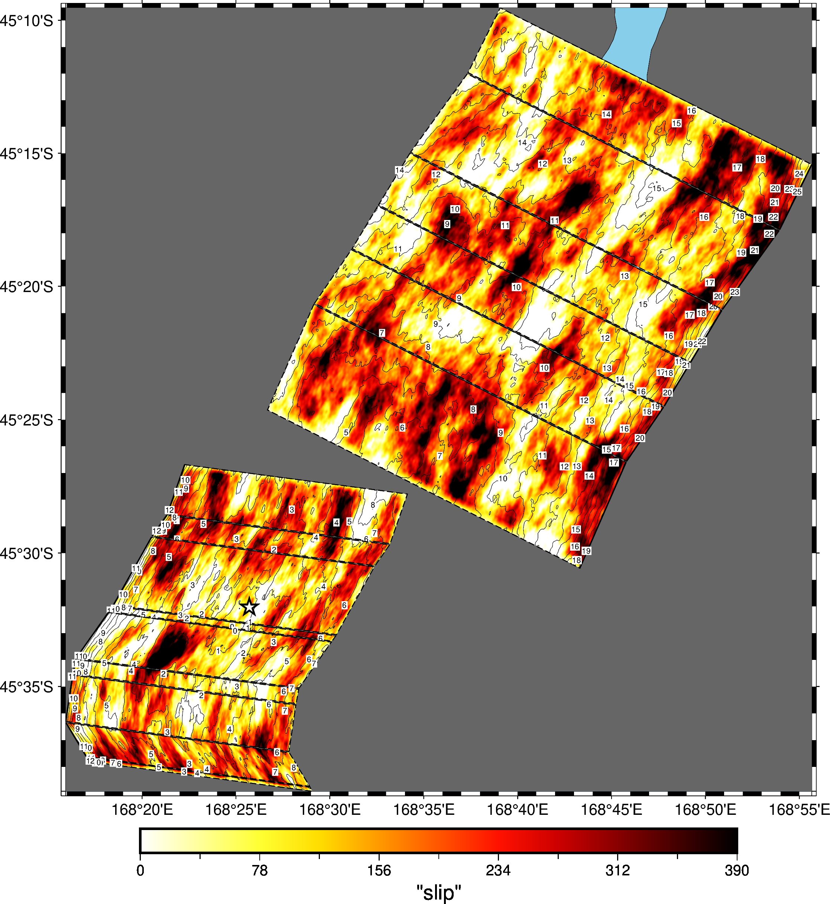

In the above example, the rupture jumps between two segments. The metadata for the jumping behaviour is stored in the new realisation format. Hence, to have the jumps plotted, you must provide the realisation to the tool.

```bash
$ plot-srf SRF_FFP OUTPUT_PLOT_FFP --realisation-ffp REALISATION_FFP
```

See the help text to find more formatting options. You will probably be interested in `--title` and the padding options.

> [!NOTE]
> If your rupture is especially large, you'll want to disable the
> annotations feature with the `--no-annotations` flag.

# How Do I Plot a Moment Rate Function?

The tool for this job is `plot-srf-moment`. To plot the SRF moment for a given SRF file type

```bash
$ plot-srf-moment SRF_FFP OUTPUT_PLOT_FFP
```

This will give you a plot of moment rate against time.


If you have a realisation file for the SRF in the new format, you can break this plot down for each segment in the rupture. This is achieved via the `--realisation-ffp` flag.

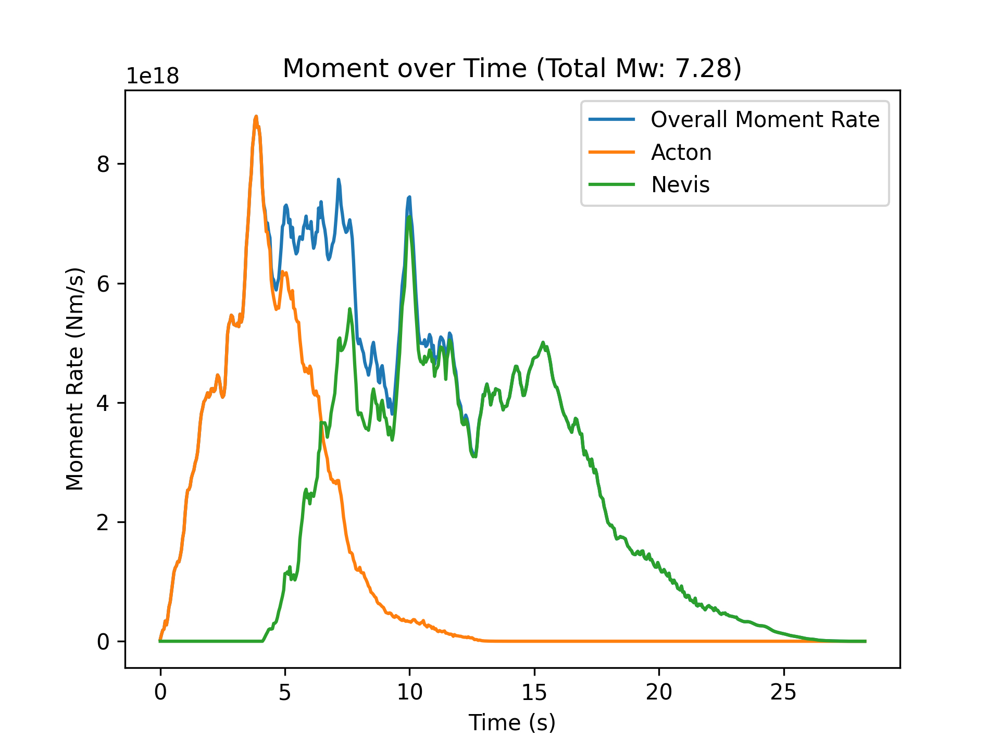

### But What If I Want Cumulative Moment?

In this case, you can use the `plot-srf-cumulative-moment` tool.

```bash
$ plot-srf-cumulative-moment SRF_FFP OUTPUT_PLOT_FFP
```

Which produces the cumulative moment function for the SRF and plots it.

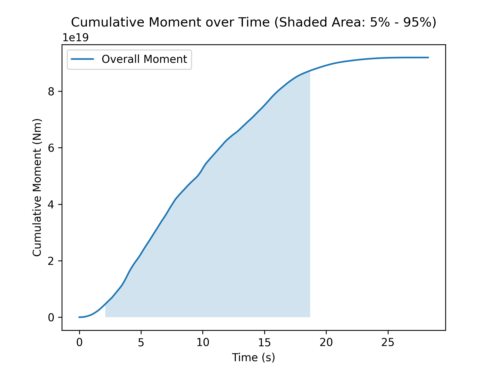

The shaded area under the curve represents the time for the rupture to release 5-95% of its moment. 

As you'd expect, you can break this down further to get the cumulative moment on each segment — if you have a realisation file for this SRF.

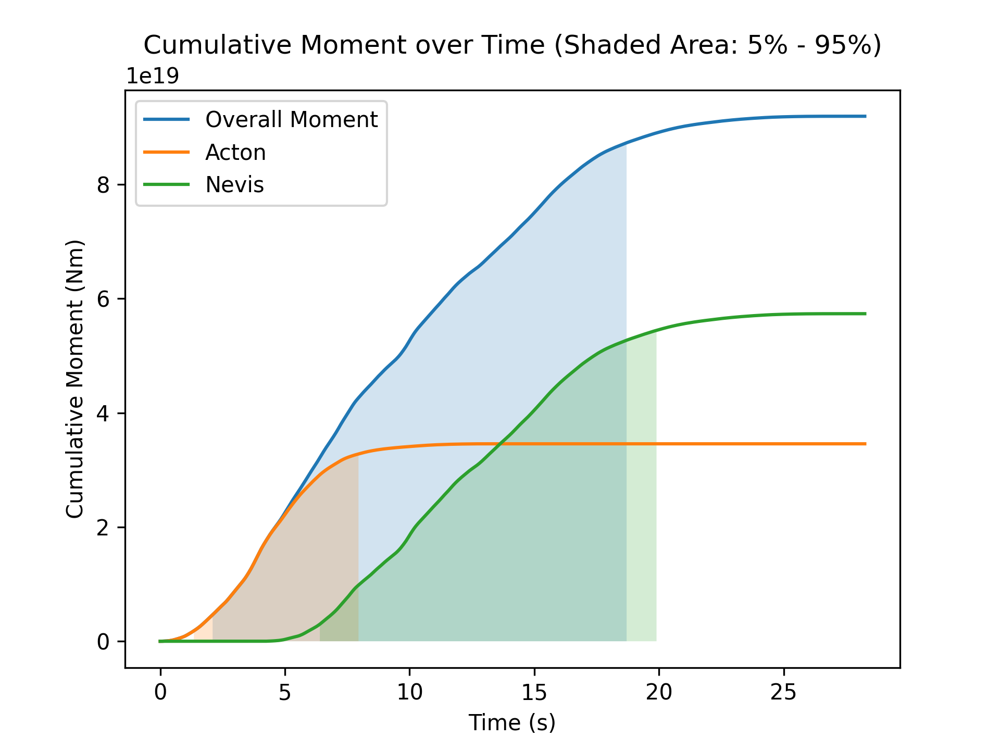

Again to get this plot you need to supply the realisation file via the `--realisation-ffp` flag.

## How Do I Plot Rake Values?

To plot the rake of an SRF, use the `plot-srf-rakes` command. This
will sample the rake values for points across the SRF and make a plot
of the vectors along each segment.

```bash
$ plot-srf-rakes SRF_FFP OUTPUT_PLOT_FFP
```

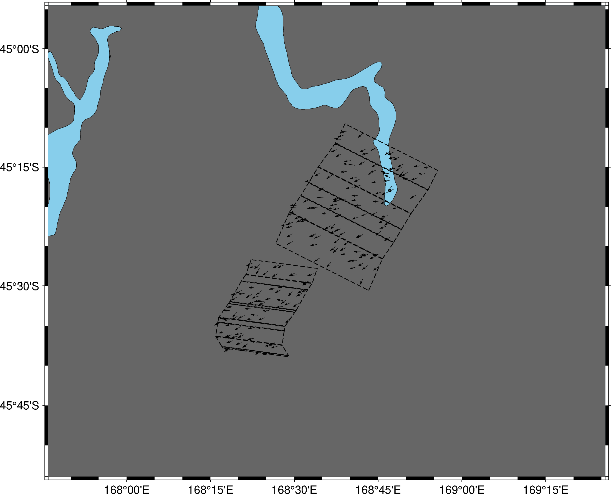

You may want to play around with the `--sample-size` flag to increase the density of the sample rakes.

## How Do I Plot Rise Times?

You should use the `plot-srf-rise` command. This will plot the rise times for each point with one second contours.

```bash
plot-srf-rise SRF_FFP OUTPUT_PLOT_FFP
```

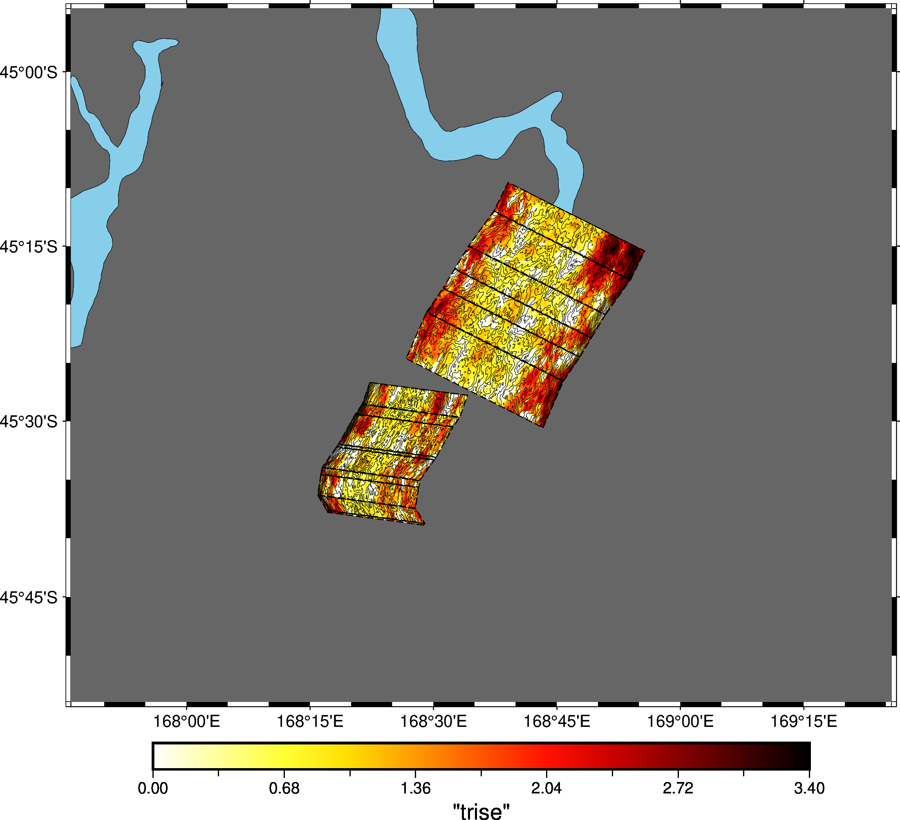

## How Do I Plot Segment Magnitudes?

If you want to plot the magnitude of a rupture against the magnitude
on each segment, use the `plot-mw-contributions` command. 

> [!NOTE]
> To use this command, you *must* have a realisation along with the SRF.

```bash
plot-mw-contributions SRF_FFP REALISATION_FFP OUTPUT_PLOT_FFP
```

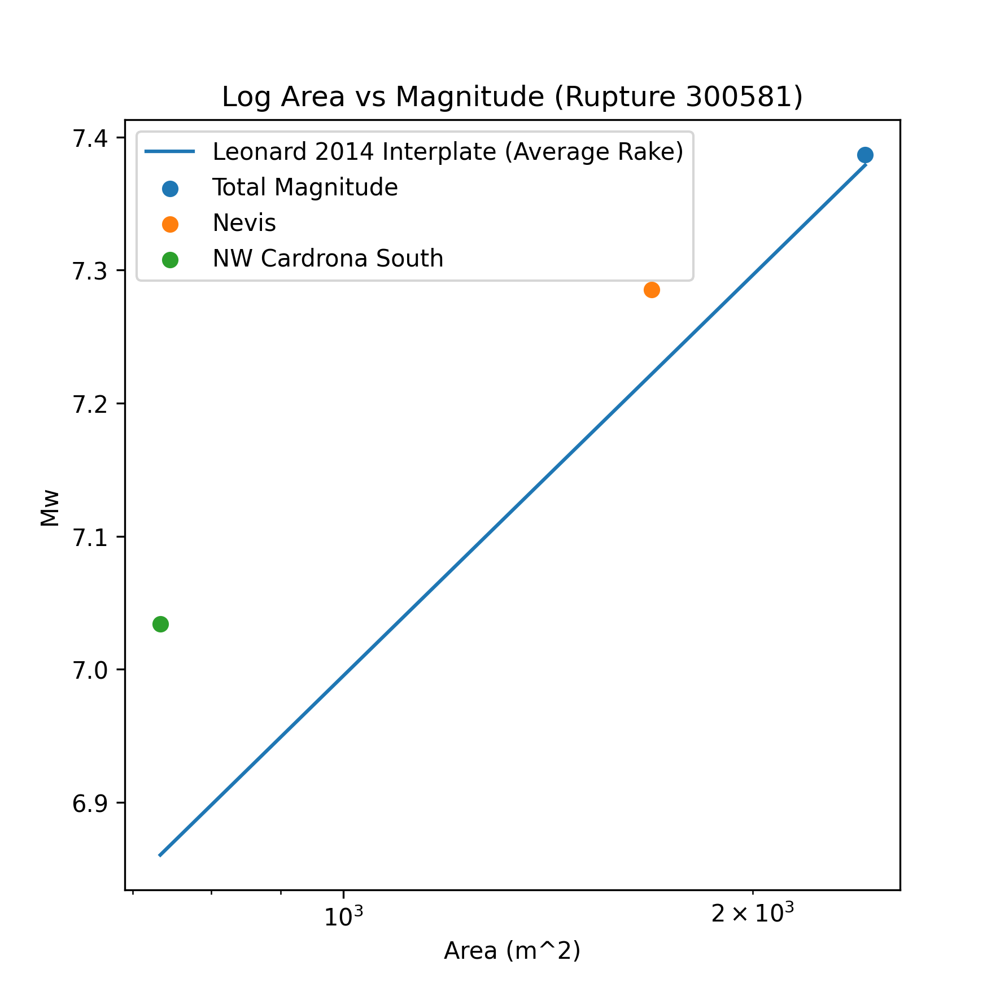

## How Do I Recreate the Slip-Rise-Rake Plots From Old Papers
To recreate the plots from old papers with new code. Then you want to use `plot-slip-rise-rake` with the `--segment` parameter to specify the segment of the SRF to plot. For single-segment ruptures you can just pass `--segment 1`. It is recommended to set width smaller than height because this is a tall plot.

> [!NOTE]
> To use this command, you *must* have a realisation along with the SRF.

```bash
plot-slip-rise-rake realisation.json realisation.srf plot.png --segment 1 --width 15 --height 30
```

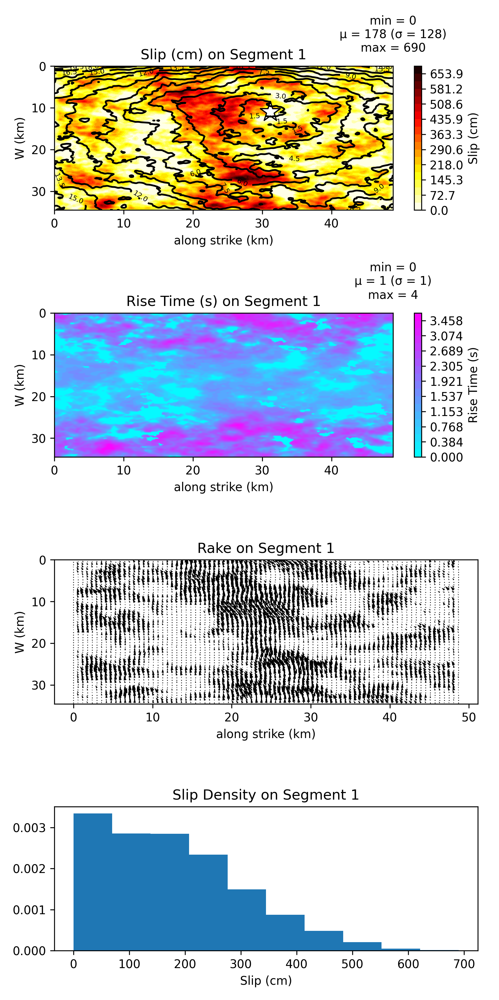


## How Do I Plot Statistics for Multi-Segment
You want to use `plot-slip-rise-rake`. It is recommended to set width larger than height because this is a wide plot. You should make this plot very big.

> [!NOTE]
> To use this command, you *must* have a realisation along with the SRF.

```bash
plot-slip-rise-rake realisation.json realisation.srf plot.png --width 200 --height 100 --plot_type PLOT_TYPE
```

The option `--plot_type PLOT_TYPE` controls what you to plot based on `PLOT_TYPE`.

### Plot type `rise` 
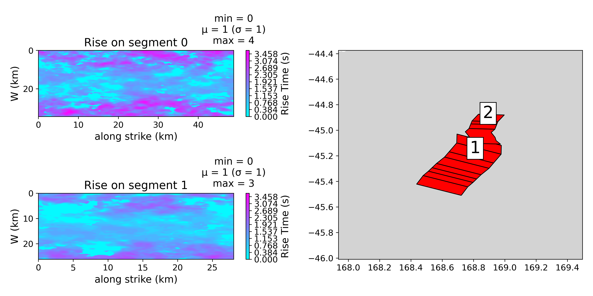
### Plot type `rake` 
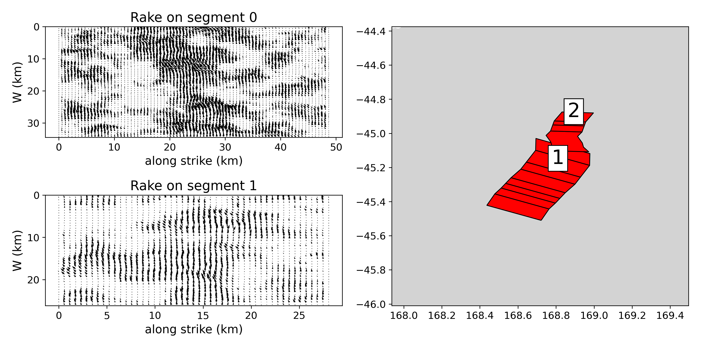
### Plot type `dist` 
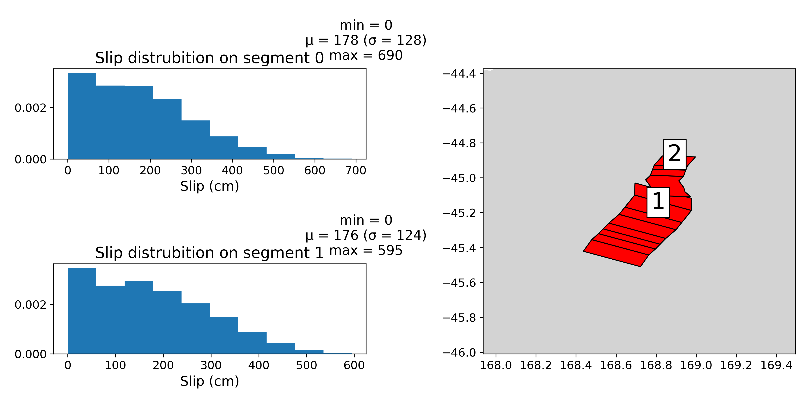
### Plot type `slip` 
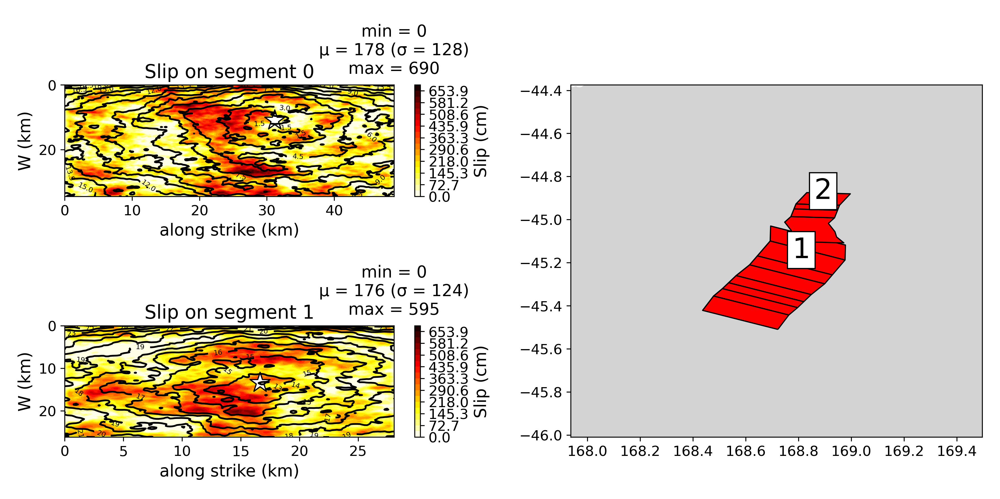
